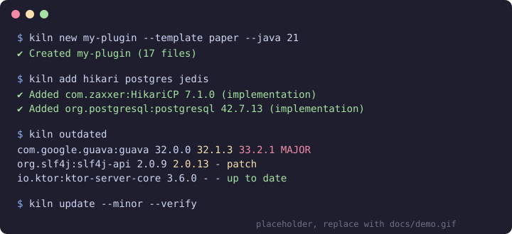

<div align="center">

# kiln

**Set up JVM projects in seconds. Add, check and update Gradle & Maven dependencies without leaving your terminal.**

[](https://github.com/QuadrixYT18/kiln/actions/workflows/ci.yml)
[](https://github.com/QuadrixYT18/kiln/releases/latest)
[](https://crates.io/crates/kiln-jvm)
[](#license)

<!-- TODO: record a short demo (e.g. with https://github.com/charmbracelet/vhs), save it as
     docs/demo.gif and point the image below at it. docs/demo.svg is only a placeholder. -->


</div>

kiln is a single, fast binary for Windows, macOS and Linux that does two things well:

1. **`kiln new`** scaffolds a ready-to-build JVM project (Paper/Velocity plugins, libraries,
   Ktor or Spring Boot services, plain Gradle) with the **latest dependency versions looked up
   live**, a Gradle wrapper, a version catalog and optional Docker, CI, Renovate and license files.
2. **`kiln add | outdated | update | remove`** manage dependencies in **Gradle (Kotlin DSL, Groovy DSL,
   version catalogs) and Maven** projects. Edits are surgical: your formatting, comments and
   line endings (LF or CRLF) are preserved byte for byte.

```console
$ kiln add hikari postgres jedis
✔ Added com.zaxxer:HikariCP 7.1.0 (implementation) to :
✔ Added org.postgresql:postgresql 42.7.13 (implementation) to :
✔ Added redis.clients:jedis 6.2.0 (implementation) to :
  wrote gradle/libs.versions.toml
  wrote build.gradle.kts

$ kiln outdated
Dependency                      Current  Patch   Minor   Major   Status      Where
com.google.guava:guava          32.0.0   -       32.1.3  33.2.1  MAJOR       libs.versions.toml
org.slf4j:slf4j-api             2.0.9    2.0.13  -       -       patch       libs.versions.toml
plugin org.jetbrains.kotlin.jvm 2.4.20   -       -       -       up to date  libs.versions.toml
```

## Contents

- [Installation](#installation)
- [Quickstart](#quickstart)
- [Commands](#commands)
- [Configuration](#configuration)
- [Custom templates](#custom-templates)
- [How it works](#how-it-works)
- [Platform notes](#platform-notes)
- [Releasing](#releasing-maintainers)
- [Contributing](#contributing) · [License](#license)

## Installation

### macOS

```sh
brew install QuadrixYT18/tap/kiln
```

or with the installer script:

```sh
curl --proto '=https' --tlsv1.2 -LsSf https://github.com/QuadrixYT18/kiln/releases/latest/download/kiln-jvm-installer.sh | sh
```

### Windows

```powershell
scoop bucket add kiln https://github.com/QuadrixYT18/scoop-bucket
scoop install kiln
```

or with the installer script:

```powershell
powershell -ExecutionPolicy Bypass -c "irm https://github.com/QuadrixYT18/kiln/releases/latest/download/kiln-jvm-installer.ps1 | iex"
```

<!-- winget: uncomment once the winget publishing job is enabled (see "Releasing")
```powershell
winget install QuadrixYT18.kiln
```
-->

### Linux

```sh
curl --proto '=https' --tlsv1.2 -LsSf https://github.com/QuadrixYT18/kiln/releases/latest/download/kiln-jvm-installer.sh | sh
# or, with Homebrew on Linux:
brew install QuadrixYT18/tap/kiln
```

### From crates.io

```sh
cargo install kiln-jvm        # installs the `kiln` binary
# or, prebuilt: cargo binstall kiln-jvm
```

> The crate is called **`kiln-jvm`** because the name `kiln` is taken on crates.io by an unrelated
> project. The command you run is always `kiln`.

### Manual download

Prebuilt archives (`.zip` for Windows, `.tar.xz` for macOS/Linux) with `.sha256` checksums are attached to every
[GitHub Release](https://github.com/QuadrixYT18/kiln/releases). Release binaries carry a
[build provenance attestation](https://docs.github.com/actions/security-for-github-actions/using-artifact-attestations):

```sh
gh attestation verify kiln-jvm-x86_64-unknown-linux-gnu.tar.xz --repo QuadrixYT18/kiln
```

### Unsigned binaries: Gatekeeper and SmartScreen

The release binaries are **not code-signed** (yet). Package managers and the installer scripts avoid the
warnings below; they only show up for manually downloaded files.

**macOS (Gatekeeper)** says *"kiln cannot be opened because the developer cannot be verified"*:

```sh
xattr -d com.apple.quarantine /path/to/kiln          # remove the quarantine flag, or
```

or open **System Settings → Privacy & Security** and click **Open Anyway** right after the first blocked start.

**Windows (SmartScreen)** says *"Windows protected your PC"*: click **More info → Run anyway**, or unblock the
file before extracting it:

```powershell
Unblock-File .\kiln-jvm-x86_64-pc-windows-msvc.zip
```

### Shell completions

```sh
kiln completions bash > ~/.local/share/bash-completion/completions/kiln
kiln completions zsh  > "${fpath[1]}/_kiln"
kiln completions fish > ~/.config/fish/completions/kiln.fish
kiln completions powershell | Out-String | Invoke-Expression      # add to $PROFILE to keep it
```

## Quickstart

```sh
# new project (interactive wizard) ...
kiln new
# ... or fully scripted
kiln new my-plugin --template paper --lang kotlin --java 21 --ci github

cd my-plugin
./gradlew build                   # Windows: gradlew.bat build

kiln add hikari postgres          # add dependencies by alias, search term or coordinates
kiln add junit mockk --test
kiln outdated                     # what is outdated?
kiln update --minor --verify      # update, build, roll back if the build breaks
```

Run `kiln <command> --help` for all options and examples.

## Commands

Global options: `-C, --path <DIR>` (run elsewhere), `--offline`, `--no-cache`, `-v, --verbose` (full URLs and error details), `-y, --yes` (never prompt),
`--color <auto|always|never>`. `NO_COLOR` is respected.

### `kiln new [NAME]`

Creates a project from a template. Without `NAME`/`--template` an interactive wizard asks for everything;
with flags it runs unattended.

| Template | What you get |
|----------|--------------|
| `paper` | Paper plugin: Gradle Kotlin DSL, `paper-plugin.yml`, [run-paper](https://github.com/jpenilla/run-task), optional [paperweight-userdev](https://github.com/PaperMC/paperweight) (`--paperweight`), Java or Kotlin |
| `velocity` | Velocity proxy plugin with the annotation-processed descriptor, Java or Kotlin |
| `library` | Java or Kotlin library with JUnit 5 and `maven-publish` |
| `backend` | Service with **Ktor** or **Spring Boot** (`--framework ktor\|spring`) |
| `empty` | Empty Gradle project with a version catalog |
| *your own* | see [Custom templates](#custom-templates) |

Always included: Gradle wrapper (`gradlew`, `gradlew.bat`, made executable), version catalog
`gradle/libs.versions.toml`, Foojay toolchain resolver, and **current versions of every dependency and plugin,
looked up when you run the command** (nothing is hardcoded).

Optional building blocks (wizard checkboxes or flags): `--docker` (Dockerfile + docker-compose, services via
`--db postgres,redis`), `--ci github|gitlab`, `--renovate`, `--license mit|apache-2.0|mit-or-apache-2.0`,
`.editorconfig`, `.gitignore`, `.gitattributes`, README (all on by default, `--bare` turns them off).
`git init` and a first commit happen automatically (`--no-git` to skip).

```sh
kiln new api --template backend --framework ktor --docker --db postgres --ci github
kiln new my-lib --template library --lang kotlin --license mit-or-apache-2.0
kiln new proxy-tools --template velocity --java 21 --group org.acme
```

### `kiln add <NAME>...`

```sh
kiln add hikari postgres jedis        # built-in aliases (hikari -> com.zaxxer:HikariCP, ...)
kiln add com.google.guava:guava       # explicit coordinates
kiln add okhttp                       # unknown names are searched on Maven Central
kiln add gson@2.10.1                  # pin a version
kiln add junit mockk --test           # --compile (default) | --test | --runtime | --compile-only | --annotation-processor
kiln add paper-api --compile-only     # also adds the PaperMC repository to your build
kiln add jedis --module :app --dry-run
```

- **Name resolution:** alias → `group:artifact[:version]` → Maven Central search (with the Central website's search
  as fallback; sorted by relevance and recency; you pick when ambiguous, non-interactive runs take the best hit and say so).
- **Versions:** the newest *stable* release; alpha/beta/RC/milestone/SNAPSHOT are ignored unless you pass `--pre`.
  Repositories declared in your project (e.g. `repo.papermc.io`) are queried through their `maven-metadata.xml`.
- **Where it goes:** with a version catalog, the entry lands in `libs.versions.toml` and the build script gets
  `implementation(libs.xyz)`; without one, in `build.gradle(.kts)`; in Maven, in `pom.xml` with the version as a
  property. New lines are placed next to related dependencies and use the surrounding style.
- **Multi-module:** pick with `--module`, run inside the module directory, or choose in the prompt.
- `--dry-run` prints a colored diff and writes nothing.

### `kiln outdated`

Table of all dependencies and plugins (Gradle plugins, Maven plugins and parents included) with the newest
**patch**, **minor** and **major** version. Green = current, yellow = patch/minor available, red = major available.
`--only-outdated` hides the rest, `--pre` includes pre-releases. Libraries declared with different versions in
different places are flagged as conflicts.

### `kiln update [NAME]...`

```sh
kiln update                      # pick interactively
kiln update --patch              # patch releases only
kiln update --minor              # patch + minor
kiln update --all                # everything, including major updates
kiln update guava --minor        # only matching dependencies
kiln update --minor --verify     # run the build afterwards; offer to roll back on failure
kiln update --all --dry-run
```

Major updates are called out with a warning and, when the POM points at a GitHub repository, a short summary of the
release notes (GitHub Releases API; set `GITHUB_TOKEN` for higher rate limits). A version shared by several
dependencies (a property or a catalog `[versions]` entry) is updated once. Variants such as Guava's `-jre` vs
`-android` stay in their lane.

`--verify` runs `./gradlew build` / `gradlew.bat build` (or `mvnw`/`mvn verify`); if it fails, kiln offers to restore
your files (non-interactive runs roll back automatically).

### `kiln remove <NAME>...`

Removes a dependency from the build file and, **only if nothing else uses it**, from the version catalog
(including an unused `[versions]` entry). Use `--module` to limit the removal.

### `kiln template list | save | remove | path`

Manage your own templates, see below.

### `kiln completions <bash|zsh|fish|powershell|elvish>` · `kiln cache path|clear`

## Configuration

kiln works without configuration. Optional `config.toml`:

| OS | Config directory | Cache directory |
|----|------------------|-----------------|
| macOS | `~/Library/Application Support/kiln` | `~/Library/Caches/kiln` |
| Windows | `%APPDATA%\kiln` | `%LOCALAPPDATA%\kiln\cache` |
| Linux | `~/.config/kiln` | `~/.cache/kiln` |

```toml
# config.toml
cache_ttl_secs = 3600                  # default: 1 hour
repositories = ["https://repo.example.com/maven"]   # extra repositories for lookups

[aliases]                              # your own short names (override built-ins)
hikari = "com.zaxxer:HikariCP"
mylib  = "com.acme:my-lib"

[new]                                  # defaults for `kiln new`
group   = "com.acme"
java    = 21
license = "mit-or-apache-2.0"
author  = "Jane Doe"
```

Environment variables: `KILN_CONFIG_DIR`, `KILN_CACHE_DIR`, `KILN_CACHE_TTL` (seconds), `KILN_OFFLINE`, `GITHUB_TOKEN`
(release notes), `NO_COLOR`. Service endpoints can be redirected for mirrors: `KILN_CENTRAL_URL`, `KILN_SEARCH_URL`, `KILN_SEARCH_FALLBACK_URL`,
`KILN_PLUGIN_PORTAL_URL`, `KILN_GITHUB_API_URL`, `KILN_GRADLE_API_URL`.

**Caching and offline mode.** Version lookups run in parallel and are cached (default one hour). `--offline` answers
purely from the cache (no network access); `--no-cache` bypasses it. kiln identifies itself with a
`kiln/<version> (+https://github.com/QuadrixYT18/kiln)` user agent and rate-limits its requests to the search and
GitHub APIs.

## Custom templates

A template is a folder in the `templates/` subdirectory of the config directory (`kiln template path` prints it).
Everything inside is copied, with placeholders replaced in **file contents and file names**:

| Placeholder | Meaning |
|-------------|---------|
| `{{name}}` | project name |
| `{{group}}` · `{{package}}` · `{{package_path}}` | group id, Java package, package as a path (`com/example/app`) |
| `{{class_name}}` | PascalCase project name |
| `{{java_version}}` · `{{description}}` · `{{author}}` · `{{year}}` · `{{version}}` | as the names say |
| `{{latest:group:artifact}}` | **live lookup** of the newest stable version (`?pre`, `?snapshot` options) |
| `{{plugin:plugin.id}}` | live lookup of a Gradle plugin version |
| `{{#if flag}} … {{#else}} … {{/if}}` | conditional blocks on their own lines |

**Unknown placeholders are detected automatically.** If a template contains `{{owner}}`, kiln asks for it (or takes
`--var owner=Jane`). Defaults and prompts can be set in an optional `kiln-template.toml`:

```toml
description = "Internal service skeleton"
repositories = ["https://repo.acme.com/maven"]   # for {{latest:...}} lookups

[variables.owner]
prompt  = "Team that owns this service"
default = "platform"
```

Turn an existing project into a template — package, project name, group and Java version become placeholders, pinned
catalog versions become live lookups, build output and the Gradle wrapper are left out:

```sh
cd my-service
kiln template save my-service          # --package, --project-name, --force
kiln template list
kiln new orders --template my-service --var owner=billing
```

If the template contains a `settings.gradle(.kts)`, the Gradle wrapper is added automatically.
GitHub Actions expressions like `${{ matrix.os }}` are left untouched (placeholders must not contain spaces).

## How it works

- **No reformatting.** Gradle scripts are scanned with a small comment/string-aware structure parser and edited by
  splicing exact byte ranges. Version catalogs use `toml_edit`, POMs use position-aware XML events. Comments,
  indentation, quote style and line endings are untouched (covered by fixture tests for Kotlin DSL, Groovy DSL, version
  catalogs, Maven and multi-module builds).
- **Version logic.** Maven-style ordering (`rc1 < 1.0 < 1.0.1`), stability detection (alpha, beta, RC, M1, SNAPSHOT, ...),
  and variant families (`-jre`, `-android`) so updates stay compatible.
- **What is checked.** Gradle: dependency strings and named-argument notation, `platform(...)`, `buildscript`
  classpath, plugins (`id`, `kotlin(...)`, catalog aliases), `val`/`def`/`ext`/`gradle.properties` version variables,
  catalog libraries and plugins. Maven: dependencies, `dependencyManagement`, plugins, parents, `${property}` versions
  (including properties defined in parent POMs). Dynamic versions (`1.+`, ranges) and BOM-managed dependencies are
  skipped and reported.
- **Gradle Plugin Portal.** Plugin versions are read from the plugin marker artifacts.

## Platform notes

- **Windows and macOS are first-class; Linux works too.** CI runs the full test-suite on Windows, macOS (Apple
  Silicon and Intel) and Linux.
- Config and cache locations follow each platform's conventions (see [Configuration](#configuration)); paths are never
  hardcoded with `/` or `~`.
- `gradlew.bat` is used on Windows, `./gradlew` elsewhere; `gradlew` is created executable (and flagged `+x` in git
  even when created on Windows).
- CRLF files stay CRLF, LF files stay LF; a UTF-8 BOM is preserved.
- Colors and prompts work in Windows Terminal, PowerShell, cmd, Terminal.app and iTerm2; kiln falls back to plain
  text when the terminal does not support ANSI or output is piped, and honors `NO_COLOR`.
- Paths with spaces, umlauts and very long Windows paths are handled (`kiln new "Müller App"` works).

## Releasing (maintainers)

Releases are automated; here is the one-time setup and the flow.

**One-time setup**

1. Create the repository `QuadrixYT18/kiln` (public) and push this code.
2. Create two more public repositories: **`QuadrixYT18/homebrew-tap`** and **`QuadrixYT18/scoop-bucket`** (each with at
   least a README so the default branch exists).
3. Create tokens and add them as **repository secrets** of `QuadrixYT18/kiln`
   (*Settings → Secrets and variables → Actions*):

   | Secret | Purpose |
   |--------|---------|
   | `RELEASE_PLEASE_TOKEN` | fine-grained PAT (Contents + Pull requests: read/write) on `kiln`, `homebrew-tap` and `scoop-bucket`; also pushes the Homebrew formula and Scoop manifest, and makes tags trigger the release workflow |
   | `CARGO_REGISTRY_TOKEN` | crates.io API token with *publish-new* and *publish-update* scopes |

   Optional winget: fork [`microsoft/winget-pkgs`](https://github.com/microsoft/winget-pkgs) to your account, add
   `WINGET_TOKEN` (classic PAT with `public_repo`) and set the repository **variable** `WINGET_ENABLED=true`.
   The first winget version must be submitted manually (see the
   [winget-releaser docs](https://github.com/vedantmgoyal9/winget-releaser)).
4. In *Settings → Actions → General* allow GitHub Actions to create pull requests.

**First release.** The project starts at version `0.0.0` (in `Cargo.toml` and `.release-please-manifest.json`), so the first
Conventional Commit `feat: ...` on `main` makes release-please propose **0.1.0**. Make sure the squash-merge title of the
first PR is a Conventional Commit (e.g. `feat: initial release`); otherwise release-please finds nothing to release.

**Flow: from "code is done" to "installable"**

1. Merge PRs with Conventional Commit titles into `main`.
2. release-please opens/updates a *Release PR* (version bump in `Cargo.toml`, new `CHANGELOG.md` section).
3. Merge the Release PR → release-please creates the tag `vX.Y.Z` and a *draft* GitHub Release whose notes are the
   new `CHANGELOG.md` section.
4. The tag runs the **Release** workflow (cargo-dist): builds Windows x86_64, macOS arm64/x86_64 and Linux x86_64/arm64
   binaries, creates archives with SHA-256 checksums and the shell/PowerShell installers, attests build provenance,
   uploads everything to the draft release and publishes it, then pushes to **crates.io**, the **Homebrew tap**,
   the **Scoop bucket** (and **winget**, if enabled).
5. Users can now `brew install QuadrixYT18/tap/kiln`, `scoop install kiln`, `cargo install kiln-jvm` or download from
   the Release page.

## Contributing

Bug reports, ideas and pull requests are welcome, see [CONTRIBUTING.md](CONTRIBUTING.md). Please follow the
[Code of Conduct](CODE_OF_CONDUCT.md); report security issues as described in [SECURITY.md](SECURITY.md).
Commits follow [Conventional Commits](https://www.conventionalcommits.org/).

## License

Licensed under either of

- Apache License, Version 2.0 ([LICENSE-APACHE](LICENSE-APACHE))
- MIT license ([LICENSE-MIT](LICENSE-MIT))

at your option. Unless you explicitly state otherwise, any contribution intentionally submitted for inclusion in
kiln by you, as defined in the Apache-2.0 license, shall be dual licensed as above, without any additional terms or
conditions.

The embedded Gradle wrapper files (`assets/gradle-wrapper`) are © Gradle Inc. and licensed under Apache-2.0.
